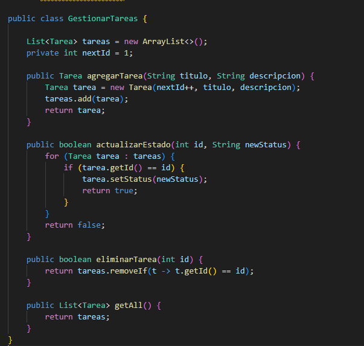

# Sistema de Gestión de Productos con TDD

### Módulo 3 - Sesión 1 - Actividad 1

### Equipo 4: 
- Felipe Lobos
- Fabiola Díaz
- Eduardo Arellano
- Carlos Vasquez
## metodología de Test-Driven Development (TDD)
### RED
tests

### GREEN
tests

Código inicial

### REFACTOR
tests

código refactorizado

